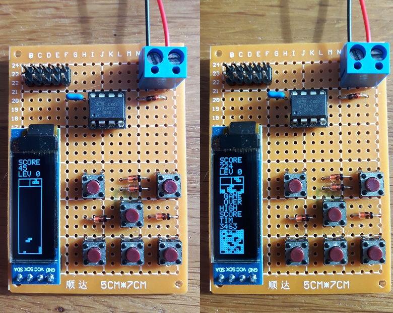

# ATtiny45 Tetris

Tetris game for an Atmel ATtiny45 using a SSD1306 based 128x32 pixel OLED screen.

## Overview

Portrait screen orientation is used, for efficient use of the screen area. The SSD1306 controller, capable of driving an 128x64 OLED screen, has 1K SRAM. When driving an 128x32 OLED, only 512 bytes are needed. The ATtiny45 has just 256 bytes of SRAM, which is not enough to hold a frame buffer. Therefore the screen is rendered in rows of 32 bits and each row is sent in four one byte pages over the I2C bus to the display controller. Up to 47 frames per second are rendered, depending on the amount of blocks in the playing field. Pushing the up and down button simultaneously displays the FPS rate. The game uses a 10x30 playing field and implements hard and soft dropping of the pieces, as well as delayed auto shift (DAS), entry delay (ARE), piece preview, hold piece and the Super Rotation System. The highest score is stored in EEPROM as well as the players name. The game will enter sleep mode automatically. The game wakes up by a button push. In game power draw is <20 mA and standby power draw is <1 mA.

## Schematic

## Prototype

