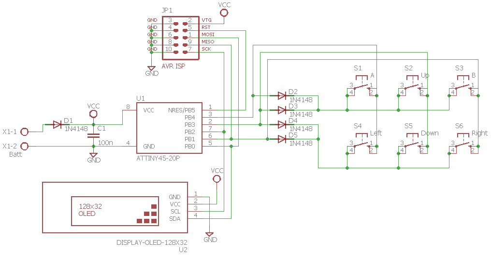

# ATtiny45 Tetris

Tetris game for an Atmel ATtiny45 using a SSD1306 based 128x32 pixel OLED screen.

## Overview

The internal 16 MHz PLL is used as the system clock source. A 2x3 button matrix with reduced IO pins is used for user input. Portrait screen orientation is used, for efficient use of the screen area.

The SSD1306 controller, capable of driving an 128x64 OLED screen, has 1K SRAM. When driving an 128x32 OLED, only 512 bytes are used. The ATtiny45 has just 256 bytes of SRAM, which is not enough to hold a frame buffer. The screen is rendered in rows of 32 bits and each row is sent in four pages of one byte to the display controller using the I2C bus at up to 45 frames per second. Pushing the up and down button simultaneously displays the FPS rate, if compiled with the DEBUG_FPS flag. The remaining 512 bytes of the SSD1306 controller is used for double buffering, if compiled with the DOUBLE_BUFFER flag.
 
The game uses a 10x30 playing field and implements hard and soft dropping of the pieces, as well as delayed auto shift (DAS), entry delay (ARE), piece preview, hold piece and the Super Rotation System.

The high score and player name are stored in EEPROM. The system will enter sleep mode automatically and the game will wake up again by a button push.

In game power draw is <20 mA and standby power draw is <1 mA.

## Schematic

## Prototype

## Firmware
The firmware has been developed in Atmel Studio 7 using GCC C and can be uploaded to the ATtiny45 using the ISP connector and an ISP programmer such as [USBasp tool](http://www.fischl.de/usbasp/) using [avrdude](http://www.nongnu.org/avrdude/):

`avrdude -p t45 -c usbasp -U flash:w:Tetris.hex:i -U eeprom:w:Tetris.eep:i -U hfuse:w:0xDD:m -U lfuse:w:0xE1:m`
